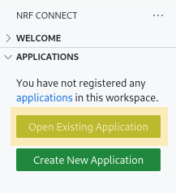
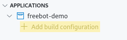
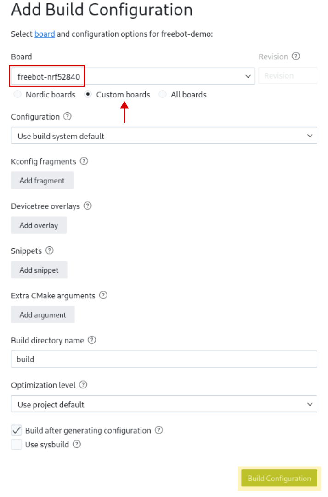
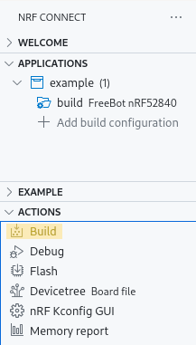

# Zephyr FreeBot Demo

- [Zephyr FreeBot Demo](#zephyr-freebot-demo)
  - [Getting started](#getting-started)
    - [Setup](#setup)
    - [Build](#build)
    - [Flash](#flash)
    - [Debug](#debug)
      - [Logging](#logging)
      - [GNU Debugger (extra)](#gnu-debugger-extra)
  - [Directory structure](#directory-structure)


## Getting started

### Setup

1. Install [nRF Connect SDK and toolchain](https://academy.nordicsemi.com/courses/nrf-connect-sdk-fundamentals/lessons/lesson-1-nrf-connect-sdk-introduction/topic/exercise-1-1/)

2. Install pyOCD (`pip install pyocd` for most systems)

3. Fetch submodules: `git submodule update --init`

4. If not present, add the workspace folder as an nRF connect application:
   <br>{width=20%}

5. If not present, create a build configuration:
   1. <br>{width=20%}
   2. <br>{width=30%}

### Build

Use Visual Studio Code UI

{width=20%}

or use nRF Connect shell

> :warning: `west` should be executed from a "nRF Connect shell" since it is often not in `$PATH` otherwise.

```sh
west build . --board freebot-nrf52840 --no-sysbuild -DBOARD_ROOT=.
```

### Flash

First, verify that the robot's wheels are in the following configuration:
<br> {width=20%}

> :information_source: Execute the following commands in a "normal" shell

Connect the robot and verify that it's [DAPLink](https://github.com/ARMmbed/DAPLink) interface is found.

```sh
$ pyocd list

      Probe/Board             Unique ID                                          Target  
-----------------------------------------------------------------------------------------
  0   Arm DAPLink CMSIS-DAP   00000080066aff574884654867025126a5a5a5a597969908   n/a 
```

Next, `pyocd` can be used to flash the FreeBot's nRF52840

```sh
$ pyocd load -t nrf52840 build/zephyr/zephyr.hex

0000484 I Loading build/zephyr/zephyr.hex [load_cmd]
[==================================================] 100%
0003017 I Erased 40960 bytes (10 sectors), programmed 40960 bytes (10 pages), skipped 0 bytes (0 pages) at 15.86 kB/s [loader]

```

### Debug

#### Logging

1. Open an nRF Serial Terminal
2. Connect using 115200 as baud rate
3. Reset the robot
4. You should now see the debug log:
   ```log
   *** Booting nRF Connect SDK d96769faceca ***
   [00:00:00.251,312] <dbg> ex_robot: main: Starting Robot
   ```

#### GNU Debugger (extra)

First start pyOCD's GDB server:
```sh
$ pyocd gdbserver -t nrf52840

0000328 I Target type is nrf52840 [board]
0000376 I DP IDR = 0x2ba01477 (v1 rev2) [dap]
0000389 I AHB-AP#0 IDR = 0x24770011 (AHB-AP var1 rev2) [discovery]
0000391 I AP#1 IDR = 0x02880000 (AP var0 rev0) [discovery]
0000423 I NRF52840 not in secure state [target_nRF52]
0000464 I AHB-AP#0 Class 0x1 ROM table #0 @ 0xe00ff000 (designer=244 part=008) [rom_table]
0000468 I [0]<e000e000:SCS v7-M class=14 designer=43b:Arm part=00c> [rom_table]
0000470 I [1]<e0001000:DWT v7-M class=14 designer=43b:Arm part=002> [rom_table]
0000473 I [2]<e0002000:FPB v7-M class=14 designer=43b:Arm part=003> [rom_table]
0000475 I [3]<e0000000:ITM v7-M class=14 designer=43b:Arm part=001> [rom_table]
0000478 I [4]<e0040000:TPIU M4 class=9 designer=43b:Arm part=9a1 devtype=11 archid=0000 devid=ca1:0:0> [rom_table]
0000481 I [5]<e0041000:ETM M4 class=9 designer=43b:Arm part=925 devtype=13 archid=0000 devid=0:0:0> [rom_table]
0000485 I CPU core #0: Cortex-M4 r0p1, v7.0-M architecture [cortex_m]
0000485 I   Extensions: [DSP, FPU, FPU_V4, MPU] [cortex_m]
0000485 I   FPU present: FPv4-SP-D16-M [cortex_m]
0000487 I This appears to be an nRF52840 QIAA D0 [target_nRF52]
0000488 I 4 hardware watchpoints [dwt]
0000490 I 6 hardware breakpoints, 4 literal comparators [fpb]
0000498 I Semihost server started on port 4444 (core 0) [server]
0000604 I GDB server started on port 3333 (core 0) [gdbserver]
```

Next, if GDB is installed, you can connect to it (in a new terminal) by running:
```sh
$ gdb -ex "target remote localhost:3333" -ex "monitor reset" -ex "load" -ex "break main" build/zephyr/zephyr.elf

...
(gdb)
```

Example GDB commands:
```
(gdb) continue
Thread 2 "main" hit Breakpoint 1, main () at src/main.c:116
116         LOG_DBG("Starting Robot");
(gdb) b main.c:142
Breakpoint 2 at 0x852: file src/main.c, line 142.
(gdb) c
Thread 2 "main" hit Breakpoint 2, main () at src/main.c:142
142             pwr_measure_demo();
(gdb) info threads
  Id   Target Id                                            Frame 
* 2    Thread 536873192 "main" (Running; Priority 0)        main () at src/main.c:142
  3    Thread 536871384 "motor_rpm" (Suspended; Priority 7) arch_swap (key=key@entry=0) at arch/arm/core/cortex_m/swap.c:48
  4    Thread 536871720 "logging" (Pending; Priority 14)    arch_swap (key=0) at arch/arm/core/cortex_m/swap.c:48
  5    Thread 536873016 "idle" (Ready; Priority 15)         arch_cpu_idle () at arch/arm/core/cortex_m/cpu_idle.S:142
```

## Directory structure

- [`src`](./src) holds the example's main.
- [`lib/freebot`](./lib/freebot)
  - [`inc`](./lib/freebot/inc/) has headers for including the FreeBot Zephyr based library
  - [`src`](./lib/freebot/src/) has the FreeBot's library sources
- [`boards/arm/freebot-nrf52840`](./boards/arm/freebot-nrf52840) has custom FreeBot board definitions for the Zephyr build system.
